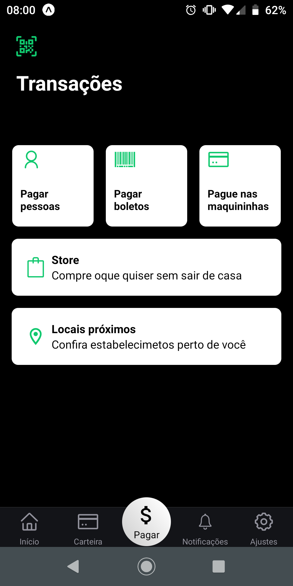

<h1 align="center">
    
</h1>
<p align="center">Picpay Clone - Interface feita em ReactNative usando Expo</p>
<br>

<p align="center">
  
  
  
  
  
</p>

## 🚀 Tecnologias

Entre as tecnologias utilizadas, destaca-se:

- [Styled Components](https://styled-components.com/)
- [Expo](https://expo.io/)
- [React Native](https://facebook.github.io/react-native/)
- [Yarn](https://yarnpkg.com/)

### 💻 Installation

```bash
# Clone this repository
$ git clone https://github.com/Erick-34/picpay-clone

# Go into the repository
$ cd picpay

# Install dependencies
$ yarn install

# IOS
$ yarn start

# Android
$ yarn android

```

## 🤔 Como contribuir

- Faça um fork desse repositório;
- Cria uma branch com a sua feature: `git checkout -b minha-feature`;
- Faça commit das suas alterações: `git commit -m 'feat: Minha nova feature'`;
- Faça push para a sua branch: `git push origin minha-feature`.

Depois que o merge da sua pull request for feito, você pode deletar a sua branch.

## :memo: Licença

Esse projeto está sob a licença MIT. Veja o arquivo [LICENSE](LICENSE.md) para mais detalhes.

---

Feito com ♥ &nbsp;by Erick Henrique.
